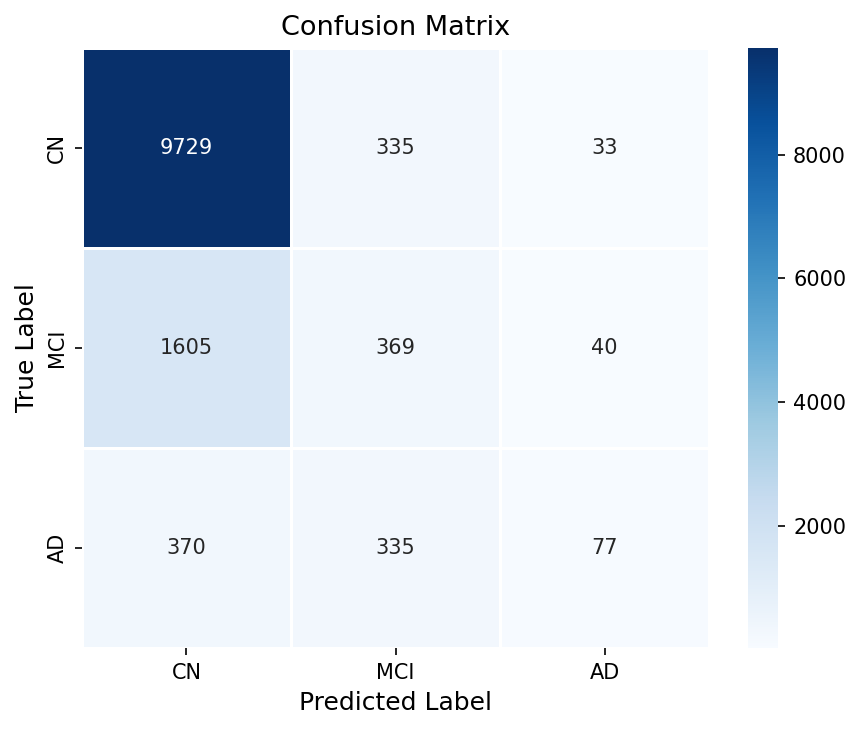

# Alzheimer's Disease Classification using MicroBiFPN

## 1. Problem Statement
Alzheimer’s disease detection from MRI scans is a challenging task due to subtle structural changes in the brain. Most existing approaches rely on computationally expensive 3D models and large datasets, making them impractical for real-world deployment.

This project aims to develop an efficient and accurate model for classifying Alzheimer’s disease stages using 2D MRI slices under limited computational resources.

---

## 2. Proposed Approach (MicroBiFPN)

We propose **MicroBiFPN**, a lightweight hybrid architecture that combines:

- CNN-based feature extraction
- Multi-scale feature fusion using BiFPN
- Attention refinement using CBAM

The model is designed to achieve strong performance while remaining **CPU-friendly and efficient**.

---

## 3. Novelty of Our Work

- Use of **BiFPN for Alzheimer’s classification** (rare in literature)
- Integration of **CBAM attention** for improved feature focus
- Adaptation from **3D MRI → 2D slices** for efficiency
- Fully **CPU-deployable architecture**
- Balanced design between **accuracy and computational cost**

Unlike heavy transformer-based models, our approach focuses on **practical deployment in resource-constrained environments**.

---

## 4. Methodology

### Step 1: Data Preparation
- Dataset: OASIS (2D MRI slices)
- Classes:
  - CN (Non Demented)
  - MCI (Very Mild Demented)
  - AD (Mild/Moderate Demented)

### Step 2: Preprocessing
- Image resizing (160×160)
- Data augmentation:
  - Horizontal flipping
  - Rotation
  - Brightness/contrast adjustment

### Step 3: Handling Class Imbalance
- Weighted random sampling
- Class-aware training strategy

### Step 4: Model Training
- Optimizer: Adam
- Learning rate scheduling
- Early stopping to prevent overfitting

---

## 5. Model Architecture

The MicroBiFPN architecture follows this pipeline:

### Key Components:
- **CNN Encoder:** Extracts spatial features
- **BiFPN:** Combines multi-scale features
- **CBAM:** Focuses on important regions
- **Classifier:** Outputs final prediction

---

## 6. Results

### Performance Metrics

| Metric | Value |
|--------|------|
| Accuracy | ~79% |
| AUC | ~0.84 |

---

### Confusion Matrix



---

### Classification Report (Summary)

- Strong performance on **CN (normal cases)**
- Moderate performance on **MCI**
- Lower recall for **AD due to subtle differences**

---

## 7. Observations

- Model performs best on majority class (CN)
- MCI and AD are harder to distinguish due to:
  - Subtle feature differences
  - Limited spatial context in 2D slices
- Results are consistent with typical 2D medical imaging benchmarks

---

## 8. Comparison with Existing Work

| Approach | Accuracy |
|--------|--------|
| 3D CNN / Transformer | 90–95% |
| Standard 2D CNN | 70–80% |
| **MicroBiFPN (Ours)** | **~79%** |

Our model achieves competitive performance while being significantly more efficient.

---

## 9. Project Structure
├── models/ # MicroBiFPN architecture
├── data/ # Dataset loading and augmentation
├── utils/ # Utility functions
├── train.py # Training pipeline
├── config.py # Configurations
├── generate_csv.py # Dataset preparation
├── training_plots/ # Output plots
├── requirements.txt # Dependencies
└── .gitignore


---

## 10. How to Run

```bash
git clone https://github.com/your-username/your-repo-name.git
cd your-repo-name
pip install -r requirements.txt
python generate_csv.py
python train.py
